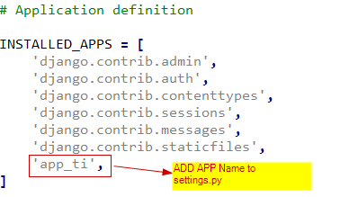

# Django Model
* A model in Django is an python object that represents a data base table.
* Each Model represents a source database table, with fields or 
  properties (or table columns) of the table record,


## Generate Django Models from existing Database Tables
* 

## Create Database Tables using Django Models
* 

## Django Models with Oracle Database, Demonstration
*

### STEP 1. Create Django APP To Demonstrate Views Response Types
* Navigate to the Project Folder `tinitiate` and in the path that has the 
  `manage.py` file.
* Create an **APP** named `app_models`
* Using the following command.
```
python manage.py startapp app_models
```

### STEP 2. Add APP details to Project settings.py file
* Locate the **PROJECTs** `settings.py` file, In this case its located in the 
  `tinitiate/tinitiate/settings.py` file
* Append the **APP** `app_models` names to the list **INSTALLED_APPS**  we 
  created in **STEP 1**

* In the same **PROJECTs** `settings.py` file add the Database details
* In this example we demonstrate using Oracle database.
```
DATABASES = {
    'default': {
        'ENGINE': 'django.db.backends.sqlite3',
        'NAME': os.path.join(BASE_DIR, 'db.sqlite3'),
    },
    'tinitiate': {
        'ENGINE':   'django.db.backends.oracle',
        'NAME':     'locahost/orcl',
        'USER':     'tinitiate',
        'PASSWORD': 'tinitiate',
    }
}
```  

### Step 3. Create DB tables
* To demonstrate here we create THREE tables in the `tinitiate` schema
* **STUDENTS TABLE**
```
create table students
    ( student_id   int
     ,student_name varchar2(30)
     ,join_date    date
     ,constraint students_pk primary key(student_id));
```
* **COURSES TABLE**
```
create table courses
    ( course_id       int
     ,course_name     varchar2(30)
     ,course_details  clob
     ,constraint courses_pk primary key(course_id));
```
* **STUDENTS_COURSES TABLE**
```
create table students_courses
    ( stu_crs_id   int
     ,student_id   int
     ,course_id    int
     ,primary key(stu_crs_id)
     ,constraint fk_courses foreign key (course_id) references courses(course_id)
     ,constraint fk_sudents foreign key (student_id) references students(student_id)
     );
```

### Step 4. Create a Django Model with INSPECTDB command
* The `inspectdb` command reads the specified DB table and generates a MODEL file
* Run the three commands one for each table:
  `students`, `courses`, `students_courses`
* In the command line go back to the project folder and locate the manage.py 
  and run the command to start the django application
* At commandline start the project, using the command:
```
python manage.py inspectdb students > app_models/model_students.py
python manage.py inspectdb courses > app_models/model_courses.py
python manage.py inspectdb students_courses > app_models/model_students_courses.py
```
* In oy


## STEP 1. PreReqs MySQL Setup
*


## Django Model with MySQL Database
* Below example demonstrates the steps needed to create a **Django Model** 
  with MySQL database.

## STEP 1. PreReqs MySQL Setup
*


## Django Data Types
*  https://www.webforefront.com/django/modeldatatypesandvalidation.html

### STEP 2. Create Django APP
* Navigate to the Project Folder and in the path that has the `manage.py` file
* Create an **APP** named `rootpages`, which will manage the `Root Level Pages`
* Using the following command.


``