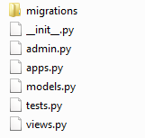

# Django Sessions
* Sessions can be considered as Server side cookies.
* These are useful for creating Logins, or send data across Webpages.
* Sessions are also useful when the client browser doesnt accept cookies, 
  to be saved.
* Django uses a special session id to identify each browser and its associated 
  session with the site.
* The session attribute, in a `view` is from the request parameter, It represents the specific user connection
  identified by a session id
* The session attribute is a dictionary object, Where we can have custom 
  key-value pairs.

## STEP 1. Create Django APP To Demonstrate Sessions
* Navigate to the Project Folder `tinitiate` and in the path that has the 
  `manage.py` file.
* Create an **APP** named `app_sessions`
* Using the following command.
```
python manage.py startapp app_sessions
```

## STEP 2. Project Folder settings.py changes
* Locate the **PROJECTs** `settings.py` file, In this case its located in the 
  `tinitiate/tinitiate/settings.py` file, Append the **APP app_sessions** name to the 
  list **INSTALLED_APPS**  we created in **STEP 1**

* By default in the `settings.py` file, the LISTS `INSTALLED_APPS` will have the 
  **django.contrib.sessions**, And the `MIDDLEWARE` LIST will have the 
  **django.contrib.sessions.middleware.SessionMiddleware**, These will enable 
  the sessions for the DJANGO SITE.

## STEP 3. Projects folder urls.py Configuration
* Create an new file `urls.py` in the APP folder
* 
* Add the following code
```
urlpatterns = [
    path('', include('app_home.urls')),
    path('app_urls/', include('app_urls.urls')),
    path('app_django_templates_inheritance/', include('app_django_templates_inheritance.urls')),
    path('app_django_html_templates/', include('app_django_html_templates.urls')),
    path('multiple_views/', include('app_multiple_view_files.urls')),
    path('app_views/', include('app_views.urls')),
    path('app_ti/', include('app_ti.urls')),
    path('app_response_types/', include('app_response_types.urls')),
    path('app_forms/', include('app_forms.urls')),
    path('app_webservices/', include('app_webservices.urls')),
    path('app_cookies/', include('app_cookies.urls')),
    path('app_sessions/', include('app_sessions.urls')),
    path('admin/', admin.site.urls),
]
```

### STEP 3. Create HTML Template in the Template Folder
* We will create HTML Templates to demonstrate this example
* The folder where we will place the HTML Template Files
  * `F:\\code\\tinitiate\\source\\python-django\\code\\tinitiate\\app_sessions\\templates`
* Add the Template Path to the `settings.py` of the Project, in the `TEMPLATES` 
  dictionary `DIRS` Dictionary.
* Folder Structure for templates
* 
* Here we are will have 2 pages
  * 1. `session_login.html` 
  * 2. `session_secured_page.html`
* The objective is Unless we make a successful login from `session_login.html` we 
  cannot access the `session_secured_page.html`
>
* Template File `session_login.html`, Place this in the `app_sessions` `template` folder
```
<form method="post" action="">

    

    <p>Type Anything for User / Password</p>
    <b>User name:</b><br>
    {{form.userid.as_text}}<br><br>
    <b>Password: </b><br>
    {{form.passwd.as_text}}<br><br>
    <hr>

    <button type="submit">Submit</button>
</form>
```
* Template file `session_secured_page.html`, Place this in the `app_sessions` `template` folder
```
<html>
    <body>
        
            <h1>Welcome USER: {{ l_user }} !, You have access to this Secure Page</h1>
            <p>Hello User</p>
            <p>To logout <a href="/app_sessions/logout/">click here</a></p>
            <br><br>
        
            <h1>You are not logged in, Cannot access this page</h1>
        
    </body>
</html>
```

## STEP 4. Create the forms.py file
* Here we use forms to demonstrate user input and save the input to a cookie.
* Create the following in the `forms.py` of the APP folder
```
from django import forms

class LoginForm(forms.Form):
    # HTML INPUT Box
    userid = forms.CharField()
    passwd = forms.CharField(max_length=32, widget=forms.PasswordInput)
```

## STEP 5. Add content to the views.py file
* The `views.py` demonstrates the following
  * Create SESSION KEY (a variable), Delete SESSION KEY
  * Here we create and assign value to the SESSION KEY "userid"
* The `views.py` here demonstrates LOGIN, ACCESS TO SECURE CONTENT and LOGOUT
* All the **THREE** above operations are handled by the USERID from the 
  login page. Any access directly to the Secure Content page will not display 
  the secure content, but will putout a message that a login is requried.
```
from .forms import LoginForm
from django.template import Template, Context, loader
from django.shortcuts import render, redirect
from django.http import HttpResponse

# Create the Session KEY "userid" and assign value from the USERID TEXT BOX
def login(request):

    if request.method == 'POST':
        # Create a New Global Response Object
        response = HttpResponse('test')

        loginForm = LoginForm(request.POST)

        if loginForm.is_valid():

            # Set the USERID as session varaible
            request.session['userid'] = loginForm.cleaned_data['userid']

            return redirect('/app_sessions/secured_page/')

    else:
        form = LoginForm()
        return render(request,'session_login.html',{'form':form})


# This page will be shown only if there is a login
def secured_page(request):

    template = loader.get_template('session_secured_page.html')
    
    # Check if the Session KEY "userid" exists
    if request.session.has_key('userid'):
        # Check if the Session KEY "userid" has a value assigned
        if request.session['userid']:
        # Data (context) to be passed to template
            context = {
                'l_user': request.session['userid']
            }
    else:
        context = { }

    return HttpResponse(template.render(context, request))


# This will clear the SESSION KEY "userid"
def logout(request):

    if request.session['userid']:
        l_user = request.session['userid']

    del request.session['userid']

    return HttpResponse("Successfully %s Logged out !"%l_user)
```

## STEP 6. APP folder urls.py Configuration
* Create an new file `urls.py` in the APP folder
* 
* Add the following code
```
from django.urls import path
from . import views

urlpatterns = [
    path('login/', views.login, name='login'),
    path('secured_page/', views.secured_page, name='secured_page'),
    path('logout/', views.logout, name='logout'),
]
```

## STEP 7. Run Project and Test URLS in Browser
* At commandline start the project, using the command:
```
python manage.py runserver
```
* Open a browser and enter the following URLS to see the various phases 
  of the SESSION KEY.
* Login using the URL:  `http://localhost:8000/app_sessions/login`
* This will be displayed after **LOGIN**: `http://localhost:8000/app_cookies/secured_page`
* Delete Session Key using: `http://localhost:8000/app_cookies/logout`
* Trying after **LOGOUT** you cannot access the secure page: `http://localhost:8000/app_cookies/secured_page`
